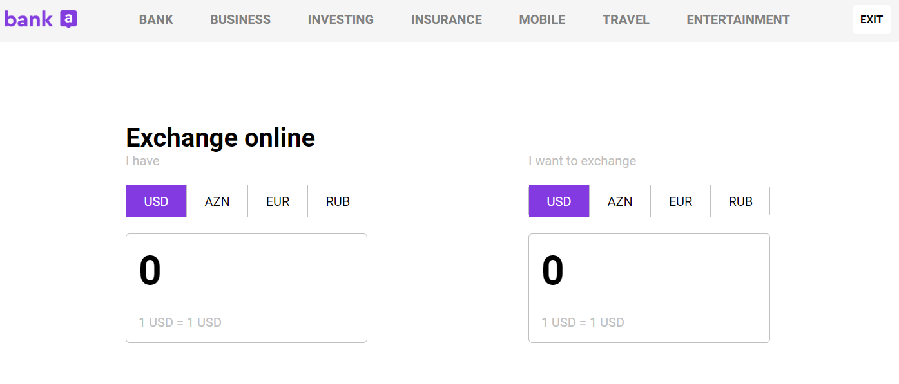

Currency Exchange App
> currencyExchangeAPI

 ## [Demo](https://nikofx.github.io/currencyExchangeAPI/)

## Tools

The Exchange App is a web application built with pure JavaScript, HTML, and CSS that enables users to view and convert currency rates using an API.

## Features

- User-friendly interface
- Real-time currency rates
- Conversion between any two currencies
- Option to select a base currency
- Option to view historical rates for a specific period
- Easy integration with any website

Free foreign exchange,
crypto rates & EU VAT Rates [API](https://exchangerate.host/)

## Meta

 Nijat Gurbanov

- Github: [github.com/NikoFX](https://github.com/NikoFX)
- Twitter: [Nijat Gurbanov](https://twitter.com/)
- Linkedin: [linkedin.com/in/nijat-gurbanov-dev](https://www.linkedin.com/in/nijat-gurbanov-dev/)

## Contributing

1. Fork it
2. Create your feature branch (`git checkout -b feature/fooBar`)
3. Commit your changes (`git commit -am 'Add some fooBar'`)
4. Push to the branch (`git push origin feature/fooBar`)
5. Create a new Pull Request
